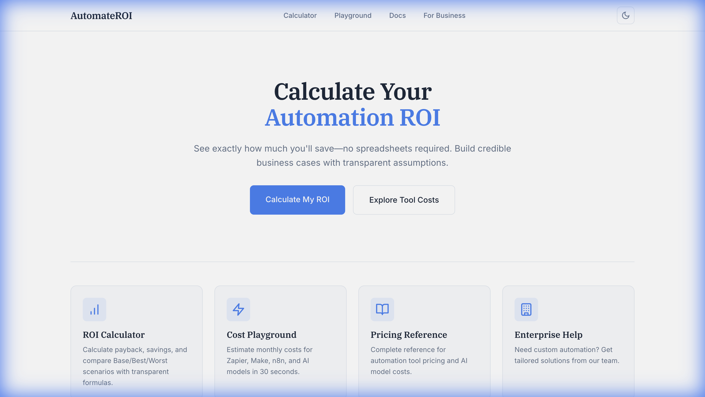
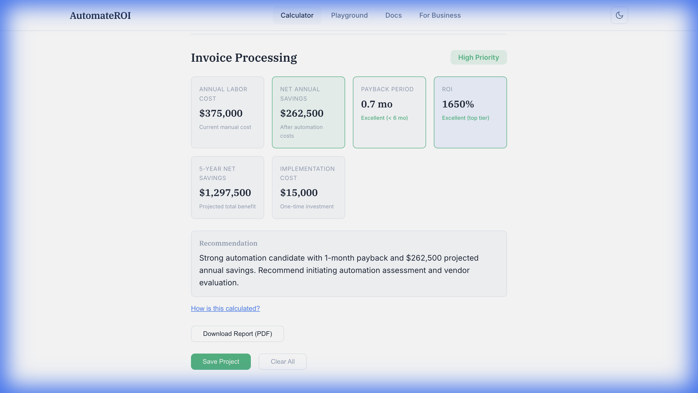
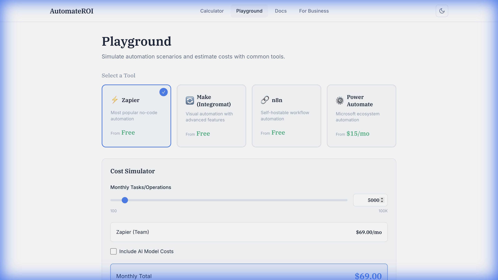

# 📊 AutomateROI

> Calculate your automation ROI in minutes. No spreadsheets required.

A modern web app to help businesses make data-driven decisions about automation investments. Calculate payback periods, compare scenarios, and generate professional PDF reports.


## ✨ Features

- **ROI Calculator** - Calculate payback, annual savings, and 5-year projections
- **Scenario Compare** - Compare Base/Best/Worst case scenarios side-by-side
- **Cost Playground** - Estimate costs for Zapier, Make, n8n, and AI models
- **PDF Reports** - Generate professional PDF reports with charts
- **Project Saving** - Save and load projects with LocalStorage
- **Dark/Light Mode** - Automatic theme with manual toggle

## 🖼️ Screenshots

### Home


### Calculator Results


### Cost Playground


## 🚀 Quick Start

### Prerequisites
- Node.js 18+
- Python 3.11+
- pip

### Frontend

```bash
cd app
npm install
npm run dev
```

Frontend runs at `http://localhost:5173`

### Backend

```bash
cd backend
pip install -r requirements.txt
python main.py
```

Backend runs at `http://localhost:8007`

## 📁 Project Structure

```
automation-roi-calculator/
├── app/                    # React frontend (Vite)
│   ├── src/
│   │   ├── components/     # Reusable components
│   │   ├── pages/          # Page components
│   │   ├── hooks/          # Custom hooks
│   │   ├── utils/          # Utilities
│   │   └── styles/         # Global CSS
│   └── package.json
├── backend/                # Python FastAPI
│   ├── main.py             # API server
│   ├── roi_calculator.py   # Business logic
│   ├── pdf_generator.py    # PDF creation
│   └── requirements.txt
└── README.md
```

## 🔧 Tech Stack

| Layer | Technology |
|-------|------------|
| Frontend | React 18, Vite, React Router |
| Styling | CSS Modules, CSS Variables |
| Backend | Python, FastAPI, FPDF |
| Charts | Chart.js |

## 📝 API Endpoints

| Method | Endpoint | Description |
|--------|----------|-------------|
| POST | `/calculate` | Calculate ROI from inputs |
| POST | `/generate-pdf` | Generate PDF report |

## 🌐 Deployment

### Vercel (Frontend)
```bash
cd app
npm run build
# Deploy dist/ to Vercel
```

### Railway/Render (Backend)
Deploy the `backend/` directory with Python runtime.

## 📄 License

MIT License - feel free to use for personal or commercial projects.

## 🤝 Contributing

1. Fork the repo
2. Create a feature branch
3. Make changes
4. Submit a PR

---

Built with ❤️ using React + FastAPI