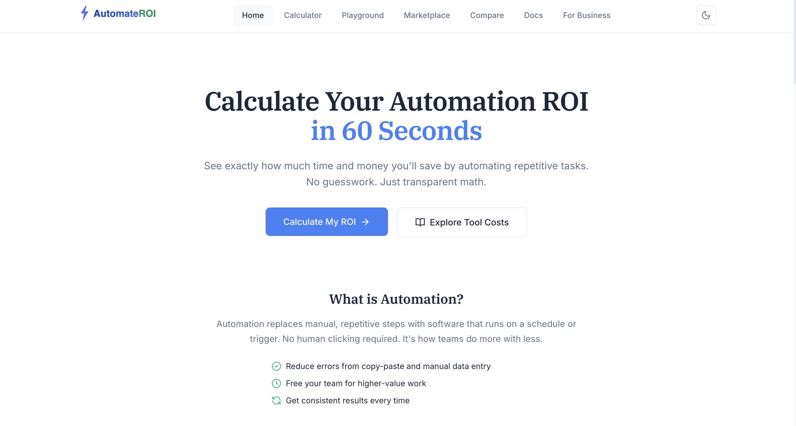
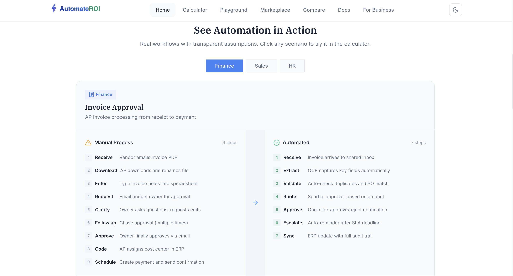
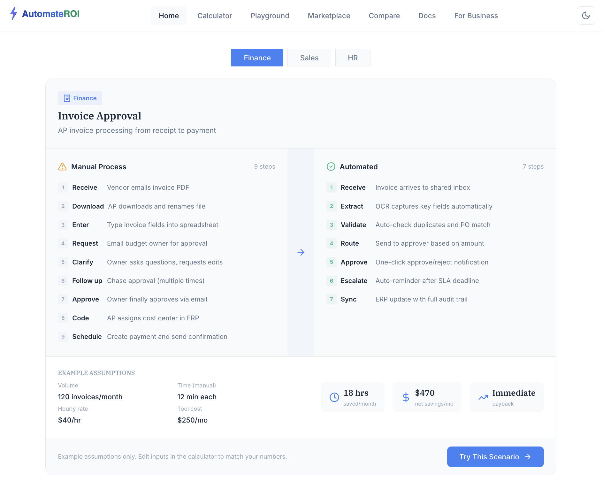
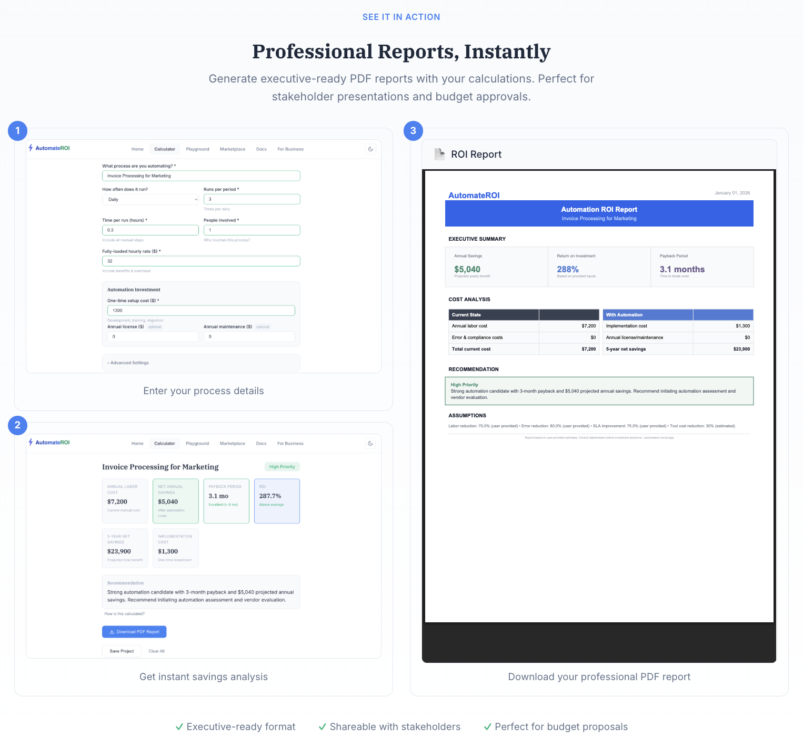
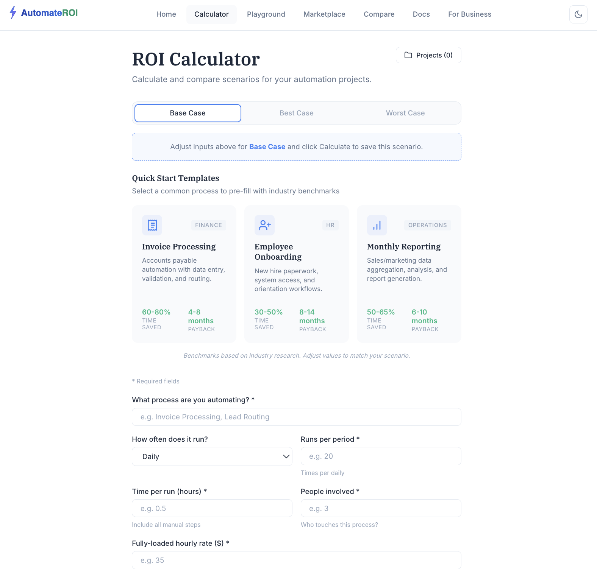
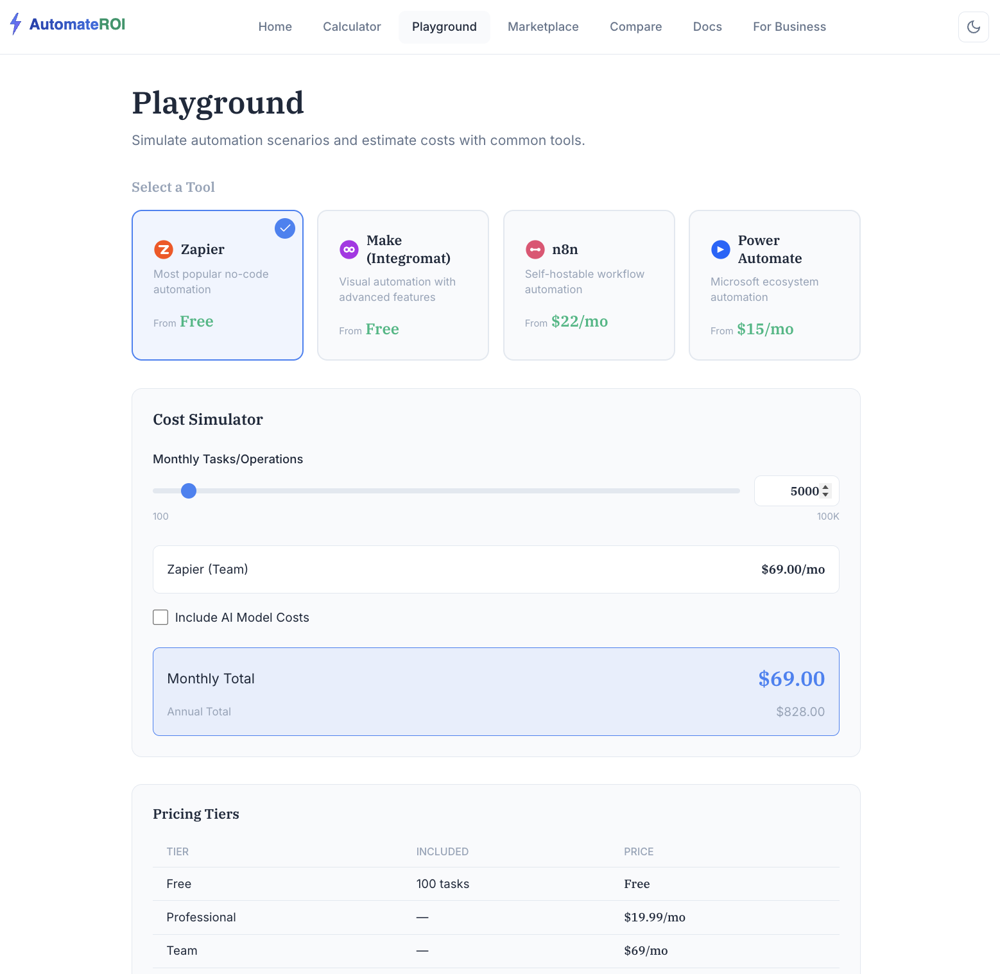
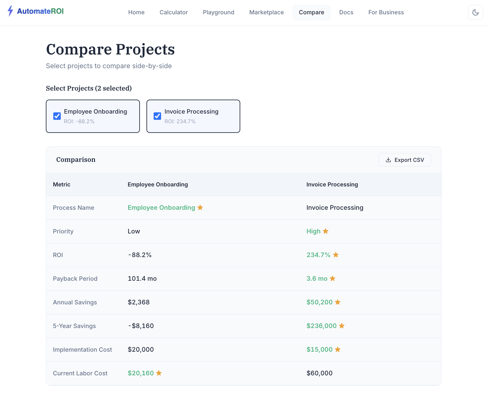
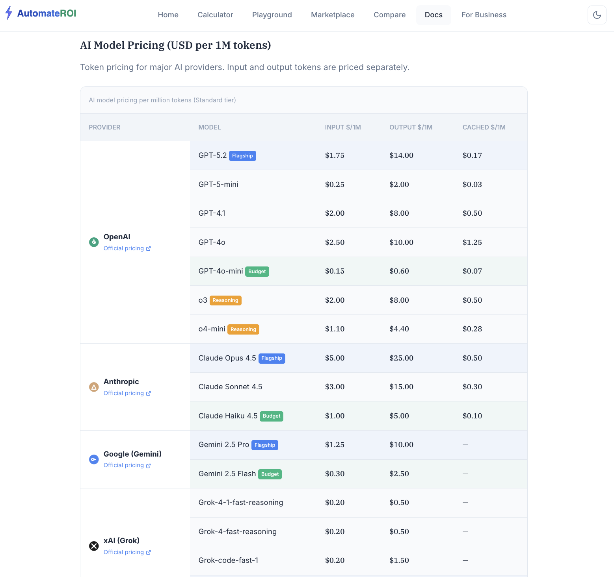

# AutomateROI - Automation ROI Calculator

A production-ready web application that helps organizations make data-driven decisions about automation investments. Calculate payback periods, compare scenarios, estimate implementation costs, and generate professional PDF reports.


---

## Table of Contents

- [The Problem](#the-problem)
- [The Solution](#the-solution)
- [Features](#features)
- [Screenshots](#screenshots)
- [Tech Stack](#tech-stack)
- [Architecture](#architecture)
- [Getting Started](#getting-started)
- [API Reference](#api-reference)
- [Project Structure](#project-structure)
- [License](#license)

---

## The Problem

Organizations evaluating automation investments face several challenges:

| Challenge | Impact |
|-----------|--------|
| **No standardized ROI methodology** | Teams use inconsistent calculations, leading to misallocated resources and rejected proposals |
| **Time-consuming analysis** | Building proper ROI models from scratch takes hours of spreadsheet work |
| **Communication gaps** | Technical teams struggle to present business value to finance and executives |
| **Expensive enterprise tools** | Most ROI calculators are locked behind enterprise software licenses |

---

## The Solution

AutomateROI is a free, open-source tool that solves these problems:

- **Instant calculation** - Enter 7 simple inputs, get comprehensive analysis in seconds
- **Visual communication** - Interactive charts make the business case clear to stakeholders
- **Professional reports** - Generate branded PDF reports for executive presentations
- **What-if analysis** - Compare base, best, and worst case scenarios side-by-side
- **Cost estimation** - Built-in playground for Zapier, Make, n8n, and AI model costs

---

## Features

### Core Functionality

- **ROI Calculator** - Calculate payback period, annual savings, ROI percentage, and 5-year projections
- **Scenario Comparison** - Compare base/best/worst case scenarios with visual charts
- **What-If Sliders** - Adjust key parameters and see real-time impact on ROI
- **Cost Playground** - Estimate costs for popular automation platforms (Zapier, Make, n8n) and AI models (GPT-4, Claude)
- **PDF Reports** - Generate professional, branded reports with charts and recommendations
- **Project Saving** - Save and load multiple projects using local storage

### Technical Features

- **Modern React Frontend** - Built with React 18, Vite, and React Router
- **FastAPI Backend** - High-performance Python API with automatic OpenAPI documentation
- **Responsive Design** - Works seamlessly on desktop, tablet, and mobile
- **Dark/Light Mode** - Automatic theme detection with manual toggle option
- **RESTful API** - Full programmatic access for integration with other systems

---

## Screenshots

### Landing Page
Calculate your automation ROI in 60 seconds with transparent math and no guesswork.



---

### Manual vs Automated Workflow Comparison
Side-by-side comparison showing how a 9-step manual process becomes a streamlined 7-step automated workflow.



---

### Workflow Analysis with Real-Time Metrics
View time saved, cost savings, and payback period calculated from process assumptions.



---

### Professional PDF Reports
Generate executive-ready PDF reports with your calculations for stakeholder presentations and budget approvals.



---

### ROI Calculator with Quick Start Templates
Pre-built templates for common automation scenarios (Invoice Processing, Employee Onboarding, Monthly Reporting) with industry benchmarks.



---

### Cost Playground
Simulate automation costs across popular platforms (Zapier, Make, n8n, Power Automate) with real pricing tiers.



---

### Project Comparison
Compare multiple automation projects side-by-side to prioritize investments based on ROI, payback period, and annual savings.



---

### AI Model Pricing Reference
Built-in documentation with current token pricing for OpenAI, Anthropic, Google, and xAI models.



---

## Tech Stack

| Layer | Technology | Purpose |
|-------|------------|---------|
| **Frontend** | React 18, Vite 5 | Modern component-based UI with fast HMR |
| **Routing** | React Router 6 | Client-side navigation |
| **Styling** | CSS Modules, CSS Variables | Scoped styles with design system tokens |
| **Charts** | Chart.js 4 | Interactive data visualizations |
| **Backend** | FastAPI, Python 3.11 | High-performance async API |
| **Validation** | Pydantic 2 | Type-safe request/response models |
| **PDF Generation** | FPDF2 | Professional PDF report creation |
| **Server** | Uvicorn | ASGI server for production |

---

## Architecture

```
                                      FRONTEND (React + Vite)
    +------------------------------------------------------------------+
    |  Components          Pages              Hooks         Utils      |
    |  - Calculator        - Home             - useTheme    - formatters|
    |  - Results           - Playground       - useProjects - calculators|
    |  - Charts            - ScenarioCompare                           |
    |  - PDFOptions                                                    |
    +------------------------------------------------------------------+
                                      |
                                      | HTTP/REST (JSON)
                                      v
    +------------------------------------------------------------------+
    |                       BACKEND (FastAPI)                          |
    |  +----------------+  +------------------+  +------------------+  |
    |  | main.py        |  | roi_calculator.py|  | pdf_generator.py |  |
    |  | API Routes     |  | Business Logic   |  | Report Generation|  |
    |  +----------------+  +------------------+  +------------------+  |
    |                     |                                            |
    |  +----------------+ |  +------------------+                      |
    |  | models.py      | |  | requirements.txt |                     |
    |  | Pydantic Models| |  | Dependencies     |                     |
    |  +----------------+ |  +------------------+                      |
    +------------------------------------------------------------------+
```

---

## Getting Started

### Prerequisites

- Node.js 18+
- Python 3.11+
- pip

### Installation

```bash
# Clone the repository
git clone https://github.com/Goku007007/automation-roi-calculator.git
cd automation-roi-calculator

# Install frontend dependencies
cd app
npm install

# Install backend dependencies
cd ../backend
pip install -r requirements.txt
```

### Running Locally

**Frontend** (Terminal 1):
```bash
cd app
npm run dev
# Runs at http://localhost:5173
```

**Backend** (Terminal 2):
```bash
cd backend
python main.py
# Runs at http://localhost:8007
```

---

## API Reference

| Method | Endpoint | Description |
|--------|----------|-------------|
| `GET` | `/health` | Health check endpoint |
| `POST` | `/calculate` | Calculate ROI from input parameters |
| `POST` | `/generate-pdf` | Generate PDF report with branding options |

### Example Request

```bash
curl -X POST http://localhost:8007/calculate \
  -H "Content-Type: application/json" \
  -d '{
    "process_name": "Invoice Processing",
    "frequency": "daily",
    "runs_per_period": 20,
    "hours_per_run": 0.5,
    "staff_count": 2,
    "hourly_rate": 45,
    "implementation_cost": 5000
  }'
```

### Example Response

```json
{
  "process_name": "Invoice Processing",
  "annual_labor_cost": 225000,
  "annual_savings": 157500,
  "implementation_cost": 5000,
  "payback_months": 0.4,
  "roi_percentage": 3050,
  "five_year_savings": 782500,
  "priority_score": "High",
  "recommendation": "Strong automation candidate..."
}
```

---

## Project Structure

```
automation-roi-calculator/
|-- app/                        # React frontend (Vite)
|   |-- src/
|   |   |-- components/         # Reusable UI components
|   |   |   |-- calculator/     # Calculator-specific components
|   |   |   |-- ui/             # Generic UI components
|   |   |-- pages/              # Page components
|   |   |-- hooks/              # Custom React hooks
|   |   |-- utils/              # Utility functions
|   |   |-- styles/             # Global CSS and design tokens
|   |-- package.json
|-- backend/                    # Python FastAPI backend
|   |-- main.py                 # API server and routes
|   |-- roi_calculator.py       # Core calculation logic
|   |-- pdf_generator.py        # PDF report generation
|   |-- models.py               # Pydantic data models
|   |-- requirements.txt        # Python dependencies
|-- docs/                       # Documentation and screenshots
|-- README.md
```

---

## Deployment

### Frontend (Vercel/Netlify)

```bash
cd app
npm run build
# Deploy the dist/ folder
```

### Backend (Railway/Render/Fly.io)

Deploy the `backend/` directory with Python 3.11 runtime.

Set environment variable:
```
PORT=8007
```

---

## License

MIT License - free to use for personal or commercial projects.

---

Built with React, FastAPI, and Chart.js