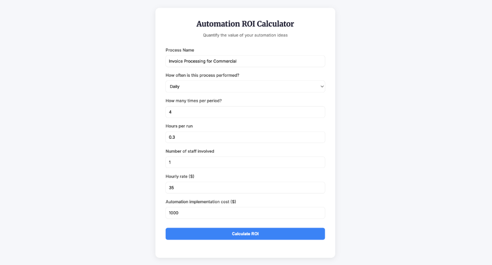
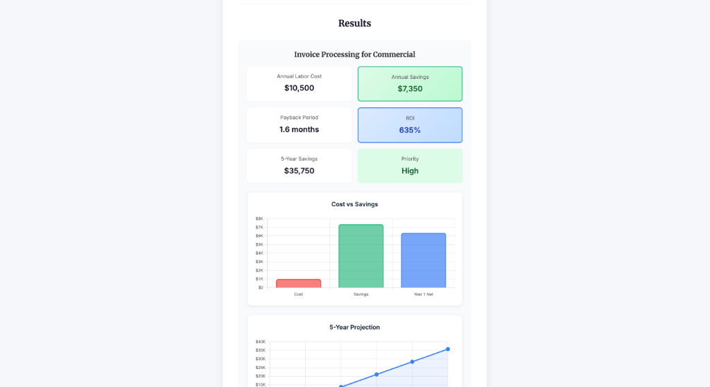
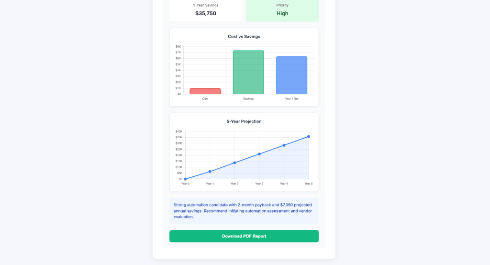
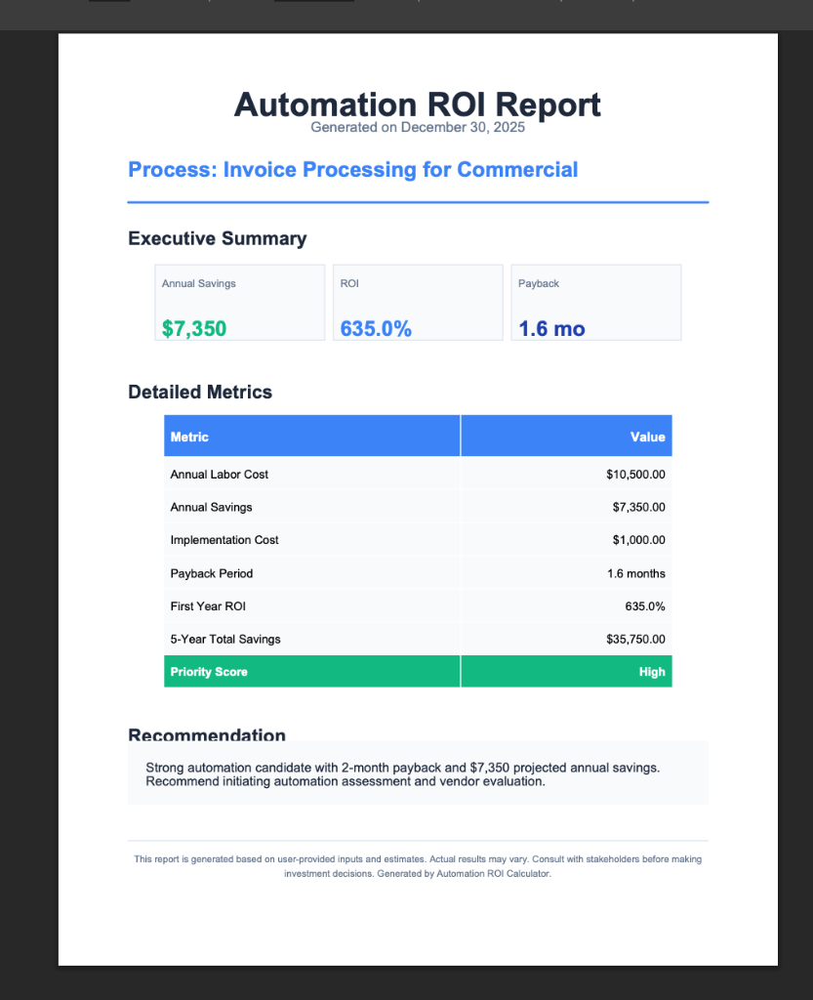

# Automation ROI Calculator

## Complete Documentation

A comprehensive, open-source tool that helps organizations quantify the financial return on investment for automating manual business processes. This calculator provides instant ROI analysis, visual charts, and professional PDF reports to support automation investment decisions.

---

## Table of Contents

1. [Overview](#overview)
2. [Why We Built This](#why-we-built-this)
3. [Key Features](#key-features)
4. [User Interface Walkthrough](#user-interface-walkthrough)
5. [PDF Report](#pdf-report)
6. [Installation Guide](#installation-guide)
7. [Usage Guide](#usage-guide)
8. [API Documentation](#api-documentation)
9. [Calculation Methodology](#calculation-methodology)
10. [Technical Architecture](#technical-architecture)
11. [Configuration Options](#configuration-options)
12. [Troubleshooting](#troubleshooting)
13. [Contributing](#contributing)
14. [License](#license)

---

## Overview

The Automation ROI Calculator is designed to answer the critical question every organization faces when considering automation:

> **"Is this automation investment worth it?"**

By inputting basic process information, users receive an instant, comprehensive analysis including:

- **Annual cost savings** from reduced manual labor
- **Payback period** showing when the investment breaks even
- **ROI percentage** for comparing against other investments
- **5-year projection** showing long-term cumulative value
- **Priority score** to help rank automation candidates
- **Professional PDF reports** for stakeholder presentations

---

## Why We Built This

### The Problem Organizations Face

**1. Lack of Standardization**

Different teams calculate automation ROI differently. Some use spreadsheets, others use rough estimates, and many skip the analysis entirely. This inconsistency leads to:
- Misallocated resources
- Rejected proposals due to inadequate justification
- Missed automation opportunities

**2. Time-Consuming Analysis**

Building a proper ROI analysis from scratch takes hours:
- Gathering input data
- Setting up formulas
- Creating visualizations
- Formatting reports

**3. Communication Challenges**

Technical teams struggle to communicate the business value of automation to:
- Finance departments who need numbers
- Executives who need summaries
- Project managers who need priorities

### Our Solution

The Automation ROI Calculator solves these problems by providing:

| Problem | Solution |
|---------|----------|
| Inconsistent calculations | Standardized methodology |
| Time-consuming analysis | Instant results in seconds |
| Complex spreadsheets | Simple 7-field form |
| Poor communication | Professional PDF reports |
| No visualization | Interactive charts |
| Expensive tools | Free and open source |

---

## Key Features

### Core Functionality

**1. Instant ROI Calculation**
- Enter 7 simple inputs
- Receive comprehensive analysis immediately
- No waiting, no complex setup

**2. Visual Data Representation**
- **Cost vs Savings Bar Chart**: Compare implementation cost, annual savings, and Year 1 net value
- **5-Year Projection Line Chart**: Visualize cumulative savings trajectory

**3. Priority Scoring**
- Automatic classification: High, Medium, or Low
- Based on ROI percentage thresholds
- Helps organizations rank multiple automation candidates

**4. Professional PDF Reports**
- Executive-ready format
- Includes all metrics, visualizations, and recommendations
- Branded with date and process name
- Suitable for presentations and documentation

**5. Smart Recommendations**
- AI-generated text explanations
- Actionable next steps
- Context-aware based on results

### Technical Features

**6. Modern Web Interface**
- Clean, responsive design
- Works on desktop, tablet, and mobile
- No installation required for end users

**7. RESTful API**
- Full programmatic access
- JSON input/output
- Easy integration with other systems

**8. Optional Authentication**
- JWT-based token system
- Enable when needed for security
- Disabled by default for simplicity

**9. Open Source**
- MIT licensed
- Fully customizable
- Self-hosted on your infrastructure

---

## User Interface Walkthrough

### Step 1: The Input Form

When you open the calculator, you see a clean, intuitive form:



#### Form Fields Explained

| Field | Purpose | Guidelines |
|-------|---------|------------|
| **Process Name** | Identifies the automation candidate | Be specific: "Invoice Processing for Commercial Clients" instead of just "Invoices" |
| **Frequency** | How often the process runs | Options: Every Minute, Hourly, Daily, Weekly, Biweekly, Monthly, Quarterly |
| **Runs per Period** | Number of executions in each period | If frequency is "Daily" and you process 20 invoices per day, enter 20 |
| **Hours per Run** | Time spent per single execution | Measure or estimate the average time to complete one run |
| **Staff Count** | Number of people involved | Include all staff who participate in the process |
| **Hourly Rate** | Average cost per hour per person | Include fully-loaded cost (salary + benefits + overhead) for accuracy |
| **Implementation Cost** | One-time automation investment | Include software, development, training, and deployment costs |

#### Tips for Accurate Inputs

1. **Measure, don't guess**: Time a few actual process executions
2. **Use fully-loaded costs**: Base salary is typically 50-70% of true cost
3. **Include all steps**: Don't forget handoffs, reviews, and corrections
4. **Be conservative**: Underestimate savings rather than overestimate

### Step 2: The Results

After clicking "Calculate ROI", the results section appears:



#### Metrics Explained

**Annual Labor Cost**
- The total annual cost of the manual process
- Formula: `hours × runs × periods × staff × rate`
- This is your baseline cost

**Annual Savings** (Highlighted in Green)
- How much you'll save by automating
- Default assumes 70% of labor is eliminated
- Based on industry benchmarks for automation

**Payback Period**
- Months until the investment is recovered
- Calculated as `(implementation cost / annual savings) × 12`
- Lower is better

**ROI Percentage** (Highlighted in Blue)
- First-year return on investment
- Formula: `((savings - cost) / cost) × 100`
- Compared against typical investment returns (e.g., 8-10% stock market)

**5-Year Savings**
- Cumulative value over 5 years
- Shows long-term impact
- Formula: `(annual savings × 5) - implementation cost`

**Priority Score**
- High: ROI > 100% (green)
- Medium: ROI 50-100% (amber)
- Low: ROI < 50% (red)

### Step 3: Visual Charts

The charts provide visual communication tools:



#### Cost vs Savings Bar Chart

Three bars showing:
1. **Cost** (Red): Implementation investment
2. **Savings** (Green): Annual savings from automation
3. **Year 1 Net** (Blue): First year profit/loss

This chart instantly shows whether Year 1 is profitable.

#### 5-Year Projection Line Chart

A line graph showing cumulative net savings:
- Y-axis: Dollar amount (with compact formatting like $35K)
- X-axis: Year 0 through Year 5
- Shows the growth trajectory of your investment

### Step 4: Recommendation and Download

Below the charts, you'll find:

**AI-Generated Recommendation**
- Contextual advice based on your specific results
- Includes payback period and savings amount
- Suggests next steps

**Download PDF Report Button**
- Click to generate and download a professional report
- Suitable for presentations and documentation

---

## PDF Report

The generated PDF report is designed for professional presentation:



### Report Sections

#### Header
- Title: "Automation ROI Report"
- Generation date
- Process name with visual divider

#### Executive Summary
Three highlighted metric cards:
- Annual Savings (in dollars)
- ROI (as percentage)
- Payback Period (in months)

#### Detailed Metrics Table
Complete breakdown including:
- Annual Labor Cost
- Annual Savings
- Implementation Cost
- Payback Period
- First Year ROI
- 5-Year Total Savings
- Priority Score (color-coded row)

#### Recommendation
Text-based recommendation with:
- Summary of the opportunity
- Key numbers highlighted
- Suggested next steps

#### Footer
Disclaimer noting:
- Based on user-provided inputs
- Results may vary
- Consult stakeholders before decisions

---

## Installation Guide

### System Requirements

| Requirement | Version |
|-------------|---------|
| Python | 3.9 or higher |
| pip | Latest |
| Web Browser | Chrome, Firefox, Safari, Edge |
| Operating System | Windows, macOS, or Linux |

### Step-by-Step Installation

#### 1. Clone the Repository

```bash
git clone https://github.com/Goku007007/automation-roi-calculator.git
cd automation-roi-calculator
```

#### 2. Create Virtual Environment

**macOS/Linux:**
```bash
python3 -m venv venv
source venv/bin/activate
```

**Windows:**
```bash
python -m venv venv
venv\Scripts\activate
```

#### 3. Install Dependencies

```bash
pip install -r backend/requirements.txt
```

#### 4. Start the Backend Server

```bash
cd backend
python main.py
```

You should see:
```
INFO:     Uvicorn running on http://0.0.0.0:8007
INFO:     Application startup complete.
```

#### 5. Open the Frontend

Open `frontend/index.html` in your web browser.

You can either:
- Double-click the file
- Right-click and "Open with" your browser
- Use a local server: `python -m http.server 3000` in the frontend folder

### Verifying Installation

1. Open the frontend in your browser
2. Fill out the form with test data
3. Click "Calculate ROI"
4. Verify results appear
5. Click "Download PDF Report"
6. Confirm PDF downloads successfully

---

## Usage Guide

### Basic Workflow

```
Enter Data → Calculate → Review Results → Download Report → Present to Stakeholders
```

### Detailed Steps

#### Step 1: Identify the Process

Before using the calculator, clearly define:
- What manual process are you analyzing?
- Who performs it?
- How is it currently done?
- What would automation look like?

#### Step 2: Gather Data

Collect the following information:

| Data Point | How to Get It |
|------------|---------------|
| Process frequency | Check calendars, schedules, or workflows |
| Runs per period | Count recent history or project forward |
| Time per run | Time actual executions or survey team |
| Staff involved | List everyone who touches the process |
| Hourly rate | Get from HR or estimate with benefits |
| Implementation cost | Get vendor quotes or estimate development |

#### Step 3: Enter Data and Calculate

1. Fill in all 7 form fields
2. Click "Calculate ROI"
3. Review the results

#### Step 4: Interpret Results

| If You See | It Means |
|------------|----------|
| Payback < 6 months | Excellent candidate |
| Payback 6-12 months | Good candidate |
| Payback 12-24 months | Moderate candidate |
| Payback > 24 months | May need reconsideration |
| ROI > 200% | Highly favorable |
| ROI 100-200% | Favorable |
| ROI 50-100% | Worth considering |
| ROI < 50% | Compare to other investments |

#### Step 5: Present to Stakeholders

1. Download the PDF report
2. Share with decision-makers
3. Discuss assumptions and caveats
4. Get approval for next steps

---

## API Documentation

### Base URL

```
http://localhost:8007
```

### Authentication

By default, authentication is disabled. When enabled:

```http
GET /token
```

Returns:
```json
{
  "access_token": "eyJhbGciOiJIUzI1NiIsInR5cCI6IkpXVCJ9...",
  "token_type": "bearer"
}
```

Include in subsequent requests:
```http
Authorization: Bearer <your_token>
```

### Endpoints

#### GET /health

Check server status.

**Request:**
```http
GET /health
```

**Response:**
```json
{
  "status": "healthy",
  "auth_required": false
}
```

#### POST /calculate

Calculate ROI for a process.

**Request:**
```http
POST /calculate
Content-Type: application/json

{
  "process_name": "Invoice Processing for Commercial",
  "frequency": "daily",
  "runs_per_period": 4,
  "hours_per_run": 0.3,
  "staff_count": 1,
  "hourly_rate": 35,
  "implementation_cost": 1000
}
```

**Response:**
```json
{
  "process_name": "Invoice Processing for Commercial",
  "annual_labor_cost": 10500.00,
  "annual_error_cost": 0.00,
  "annual_sla_cost": 0.00,
  "annual_tool_cost": 0.00,
  "total_current_cost": 10500.00,
  "automation_savings_percent": 70.0,
  "annual_savings": 7350.00,
  "implementation_cost": 1000.00,
  "payback_months": 1.6,
  "roi_percentage": 635.0,
  "five_year_savings": 35750.00,
  "priority_score": "High",
  "recommendation": "Strong automation candidate with 2-month payback and $7,350 projected annual savings. Recommend initiating automation assessment and vendor evaluation.",
  "confidence_level": "High",
  "assumptions": [...]
}
```

#### POST /generate-pdf

Generate a PDF report.

**Request:**
```http
POST /generate-pdf
Content-Type: application/json

{
  "process_name": "Invoice Processing for Commercial",
  "frequency": "daily",
  "runs_per_period": 4,
  "hours_per_run": 0.3,
  "staff_count": 1,
  "hourly_rate": 35,
  "implementation_cost": 1000
}
```

**Response:**
- Content-Type: `application/pdf`
- Body: PDF file binary

#### GET /token

Get an access token (when auth is enabled).

**Request:**
```http
GET /token
```

**Response:**
```json
{
  "access_token": "eyJhbGci...",
  "token_type": "bearer"
}
```

### Frequency Values

| Value | Meaning | Periods per Year |
|-------|---------|-----------------|
| every_minute | Every minute | 525,600 |
| hourly | Every hour | 8,760 |
| daily | Every day | 250 (working days) |
| weekly | Every week | 52 |
| biweekly | Every two weeks | 26 |
| monthly | Every month | 12 |
| quarterly | Every quarter | 4 |

---

## Calculation Methodology

### Core Formulas

#### 1. Annual Runs

```
periods_per_year = based on frequency (e.g., 250 for daily)
annual_runs = runs_per_period × periods_per_year
```

#### 2. Annual Labor Cost

```
annual_hours = hours_per_run × annual_runs × staff_count
annual_labor_cost = annual_hours × hourly_rate
```

**Example:**
- 4 runs/day × 250 days = 1,000 runs/year
- 0.3 hours × 1,000 runs × 1 staff = 300 hours/year
- 300 hours × $35/hour = **$10,500/year**

#### 3. Annual Savings

```
labor_reduction_percent = 70% (default, user-configurable)
annual_savings = annual_labor_cost × labor_reduction_percent
```

**Example:**
- $10,500 × 0.70 = **$7,350/year**

#### 4. Payback Period

```
payback_months = (implementation_cost / annual_savings) × 12
```

**Example:**
- ($1,000 / $7,350) × 12 = **1.6 months**

#### 5. ROI Percentage

```
first_year_net = annual_savings - implementation_cost
roi_percentage = (first_year_net / implementation_cost) × 100
```

**Example:**
- Net: $7,350 - $1,000 = $6,350
- ROI: ($6,350 / $1,000) × 100 = **635%**

#### 6. Five-Year Savings

```
five_year_savings = (annual_savings × 5) - implementation_cost
```

**Example:**
- ($7,350 × 5) - $1,000 = **$35,750**

### Priority Scoring Algorithm

```python
if roi_percentage >= 100:
    priority = "High"
elif roi_percentage >= 50:
    priority = "Medium"
else:
    priority = "Low"
```

### Assumptions

The calculator makes the following default assumptions:

1. **Working days per year**: 250 (50 weeks × 5 days)
2. **Hours per day**: 8
3. **Labor reduction from automation**: 70%
4. **Error reduction from automation**: 80%
5. **SLA improvement from automation**: 75%

All assumptions are documented in the API response.

---

## Technical Architecture

### System Diagram

```
┌─────────────────────────────────────────────────────────────────┐
│                         Browser                                  │
│  ┌─────────────────┐  ┌─────────────────┐  ┌─────────────────┐  │
│  │   index.html    │  │   styles.css    │  │     app.js      │  │
│  │  (Structure)    │  │   (Styling)     │  │  (Logic/Charts) │  │
│  └────────┬────────┘  └─────────────────┘  └────────┬────────┘  │
└───────────│─────────────────────────────────────────│───────────┘
            │                                         │
            │  HTTP Requests (JSON)                   │
            ▼                                         ▼
┌─────────────────────────────────────────────────────────────────┐
│                      FastAPI Backend                             │
│  ┌─────────────────┐  ┌─────────────────┐  ┌─────────────────┐  │
│  │    main.py      │  │  calculator.py  │  │    models.py    │  │
│  │  (API Routes)   │  │   (Logic)       │  │  (Data Models)  │  │
│  └────────┬────────┘  └────────┬────────┘  └─────────────────┘  │
│           │                    │                                 │
│           ▼                    ▼                                 │
│  ┌─────────────────┐  ┌─────────────────┐                       │
│  │ pdf_generator.py│  │     auth.py     │                       │
│  │  (PDF Reports)  │  │ (JWT Tokens)    │                       │
│  └─────────────────┘  └─────────────────┘                       │
└─────────────────────────────────────────────────────────────────┘
```

### File Structure

```
automation-roi-calculator/
├── backend/
│   ├── main.py              # FastAPI server and routes
│   ├── calculator.py        # Core ROI calculation logic
│   ├── models.py            # Pydantic input/output models
│   ├── pdf_generator.py     # ReportLab PDF generation
│   ├── auth.py              # JWT authentication
│   └── requirements.txt     # Python dependencies
├── frontend/
│   ├── index.html           # Main HTML structure
│   ├── styles.css           # CSS styling
│   └── app.js               # JavaScript (API calls, charts)
├── docs/
│   ├── ui-form.png          # Form screenshot
│   ├── ui-results.png       # Results screenshot
│   ├── ui-charts.png        # Charts screenshot
│   └── pdf-report.png       # PDF report screenshot
├── README.md                # Quick start guide
├── DOCS.md                  # Technical reference
└── automation-roi-calculator-doc.md  # This file
```

### Technology Stack

| Layer | Technology | Purpose |
|-------|------------|---------|
| **Backend Framework** | FastAPI | Modern Python web framework |
| **Data Validation** | Pydantic | Type-safe request/response models |
| **Server** | Uvicorn | ASGI server for FastAPI |
| **PDF Generation** | ReportLab | Professional PDF documents |
| **Authentication** | python-jose | JWT token handling |
| **Frontend** | HTML/CSS/JS | Native web technologies |
| **Fonts** | Google Fonts | Inter (body), Merriweather (headings) |
| **Charts** | Chart.js | Interactive data visualizations |

### Dependencies

```
# backend/requirements.txt
fastapi==0.109.0
uvicorn==0.27.0
pydantic==2.5.0
reportlab==4.0.0
python-jose==3.3.0
```

---

## Configuration Options

### Environment Variables

| Variable | Default | Description |
|----------|---------|-------------|
| `REQUIRE_AUTH` | `false` | Enable JWT authentication |

### Enabling Authentication

```bash
REQUIRE_AUTH=true python main.py
```

When enabled:
1. First call `GET /token` to obtain a token
2. Include `Authorization: Bearer <token>` in subsequent requests
3. Tokens expire after 60 minutes

### Changing the Port

Edit `backend/main.py`, line:

```python
uvicorn.run("main:app", host="0.0.0.0", port=8007, reload=True)
```

Change `8007` to your desired port.

### Customizing Calculations

Edit `backend/calculator.py` to modify:
- Default labor reduction percentage (currently 70%)
- Priority score thresholds
- Recommendation text generation

---

## Troubleshooting

### Common Issues

#### "Failed to fetch" Error

**Cause:** Backend server is not running.

**Solution:**
```bash
cd backend
python main.py
```

#### PDF Download Fails

**Cause:** Missing `implementation_cost` in ROIOutput.

**Solution:** Ensure you're using the latest code with the fix applied.

#### Charts Not Displaying

**Cause:** Chart.js CDN not loading.

**Solution:** Check internet connection or use a local Chart.js file.

#### Port Already in Use

**Cause:** Another application is using port 8007.

**Solution:** 
```bash
# Find what's using the port
lsof -i :8007

# Kill it or change the port in main.py
```

---

## Contributing

We welcome contributions! Here's how:

### Reporting Bugs

1. Open an issue on GitHub
2. Include steps to reproduce
3. Include expected vs actual behavior
4. Include screenshots if applicable

### Suggesting Features

1. Open an issue with "Feature Request" label
2. Describe the feature
3. Explain the use case

### Submitting Code

1. Fork the repository
2. Create a feature branch: `git checkout -b feature/your-feature`
3. Make changes
4. Test thoroughly
5. Submit a pull request

### Code Standards

- Python: Follow PEP 8
- JavaScript: Use consistent formatting
- Comments: Explain "why", not "what"

---

## License

**MIT License**

Copyright (c) 2024

Permission is hereby granted, free of charge, to any person obtaining a copy of this software and associated documentation files (the "Software"), to deal in the Software without restriction, including without limitation the rights to use, copy, modify, merge, publish, distribute, sublicense, and/or sell copies of the Software, and to permit persons to whom the Software is furnished to do so.

---

## Support

- **GitHub Issues**: https://github.com/Goku007007/automation-roi-calculator/issues
- **Repository**: https://github.com/Goku007007/automation-roi-calculator

---

*This documentation was generated for the Automation ROI Calculator project.*
